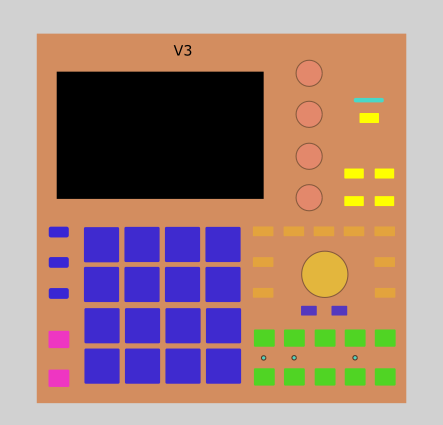
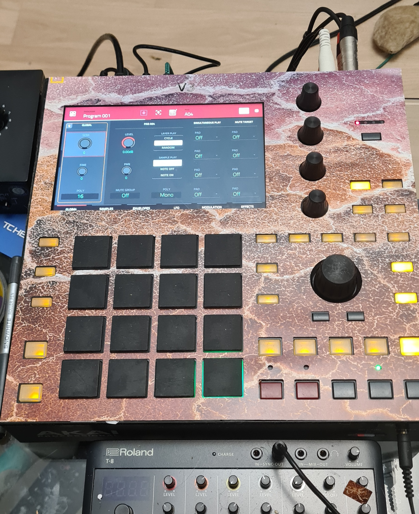

# MPC One Front Panel Template
*A simple inkscape file for a cut out template for laser cutting*

Simple template for MPC One front panel.
Created in Inkscape.
File contains editable group of objects and 
a version with all the cut outs flattened to one path object 
for easy export to *e.g. Lightburn*

Here's an example of a laser cut panel made from an old 'patterns in nature'calendar

*(you might want to remove the V3 text item ;-) )*
